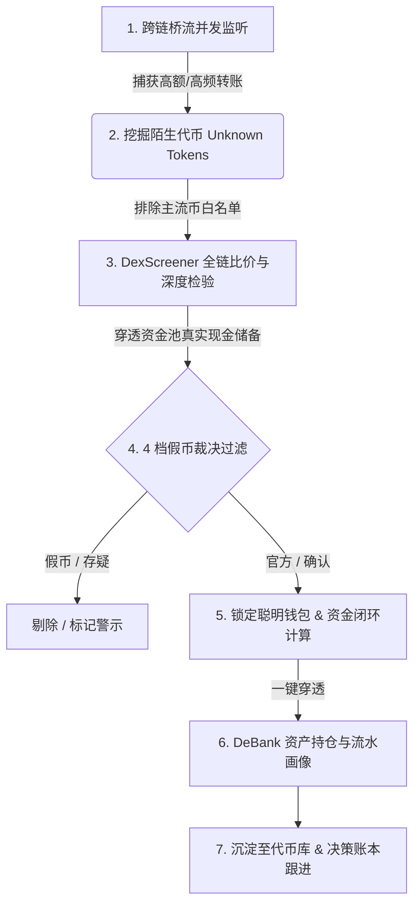

<div align="center">

# ⚡ Bridge Arb Radar · 跨链套利雷达 2.0

**面向专业 DeFi 交易员的高性能、离线优先跨链异动追踪与套利决策系统**

[](https://opensource.org/licenses/MIT)
[](https://nodejs.org/)
[](https://impeccable.style/)
[](https://www.sqlite.org/)
[](https://vitejs.dev/)

[功能特性](#-核心功能特性) • [套利方法论](#-内置套利交易方法论) • [架构设计](#-系统架构分层) • [快速上手](#-快速上手) • [实战全流程](#-实战操盘工作流) • [假币裁决算法](#-4-档假币严密裁决体系)

</div>

---

## 📖 简介与定位

在碎片化的多链 Web3 生态中，各大 DEX 与不同公链间的资产经常因**突发大单、流动性失衡或跨链延迟**产生可观的价差（Spread）。然而，跨链套利通常面临以下巨大痛点：
1. **假币陷阱 (Fake Token Trap)**：同名 Symbol 在不同链上有成百上千个虚假池子，盲目跨链直接本金归零；
2. **深度欺骗 (Ghost Liquidity)**：表面显示数万美元流动性，但池内现金（USDC/USDT）极度枯竭，卖出面临 99% 恶性滑点；
3. **资金黑盒与跟单无门**：不知道哪些跨链钱包是真正的高频套利高手。

**Bridge Arb Radar** 专为解决上述痛点打造：实时监控全网主流跨链桥消息，通过独创的**「资金闭环检测算法」**与**「4 档跨链假币裁决引擎」**挖掘真实、可执行的跨链价差机会，并提供完整的**实战操盘跟踪与已实现盈亏（Realized PnL）决策账本**。

---

## 🌟 核心功能特性

### 1. 🌉 多桥异动并发监听 (Multi-Bridge Ingestion)
- **覆盖主流跨链基础设施**：深度适配 **LayerZero**、**Wormhole**、**Hyperlane**、**Axelar**、**Range Explorer** 以及 **Blockscan** 6 大主流桥协议。
- **免 Key 优先**：大部分桥源使用官方公开只读 RPC/API，开箱即用；支持外部扩展 API Keys（保存在本地 SQLite，绝不上云）。
- **统一基类与熔断机制**：后端基于 `BaseBridgeAdapter` 统一抽象，各桥隔离并发拉取、自动归一化并具备异常熔断机制。

### 2. 🛡️ 4 档假币严密裁决引擎 (Anti-Scam Adjudication)
跨链套利最忌讳“拿真币换了假币”，雷达内置工业级交叉裁决管道：
- **`official` (官方背书)**：命中 Trust Wallet 多链注册表或 CoinGecko 官方合约白名单。
- **`confirmed` (多源核验)**：无官方白名单但多链报价一致、价格联动且经链上合约特征交叉中位数核对。
- **`suspicious` (报价存疑)**：单链独有报价、价格偏离官方锚点或链上 Symbol 存在冲突。
- **`fake` (假币警示)**：价格偏离官方锚定价格 ≥3×，或确认由虚假空投合约组建的流动性陷阱，**系统坚决拦截在套利机会之外**。

### 3. 🧠 聪明钱包画像与资金闭环分析 (Capital Cycle Detection)
不是所有跨链转账都是套利，雷达独创**闭环套利指纹算法**：
- **资金闭环 (Capital Cycle)**：自动识别「非资金代币在 A 链跨出至 B 链卖掉，随后通过稳定币/原生币从 B 链回流至 A 链」的完整套利闭环动作。
- **精细评级模型 (Score & Grade)**：基于资金闭环次数、同币往返率、跨链频次、涉及链条数给出 0~160 综合评分与 **A / B / C / D** 评级。
- **一键穿透 DeBank**：无缝直达钱包地址在 DeBank 的资产全景与历史流水。

### 4. 📊 交易员全功能实操工作台 (Trader Cockpit)
- **实时价差矩阵 (Spread Matrix)**：输入任意 Symbol，全链 DEX 实时拉取最新深度、买卖价格对比与双外链核验（DexScreener 蜡烛图 + Etherscan 合约源码）。
- **决策账本与 PnL 复盘 (Decision Ledger)**：
  - 支持工单生命周期流转：`待定 (Todo)` ➔ `观察中 (Watching)` ➔ `已执行 (Executed)` ➔ `已结算 (Closed)` ➔ `放弃 (Dropped)`。
  - **实战操盘记一笔**：记录买入卖出成本、跨链中继进度，输入每次交易的已实现盈亏增量（$\Delta \text{ USD}$），全局自动汇总累计 Realized PnL。
  - **整行丝滑展开**：长文本笔记完整排版呈现，清晰展示历史操作时间线。

### 5. 🎨 Impeccable 极客设计美学 (Impeccable Design System)
- **Kinpaku (金箔 & 漆黑) 专属调色**：深度套用 [impeccable.style](https://impeccable.style/) 官方设计系统，沉浸式黑金科技视觉。
- **金融级排版**：采用 `JetBrains Mono`（Tabular nums 等宽数字对齐），杜绝比对价格时的视觉抖动。
- **中英双语 (i18n) & 暗色/浅色模式 (Dark/Light)**：一键即时切换，状态持久化保留。

---

## 🎯 内置套利交易方法论

本系统严格遵循成熟 DeFi 套利团队的“7 步标准收敛工作流”：



1. **监控大桥**：聚焦 LayerZero, Wormhole, Blockscan, Hyperlane, Axelar, Range 6 大主流聚合层。
2. **筛选陌生代币**：过滤掉 ETH、USDT、USDC 等主流币，重点盯梢此前从未见过的非主流异动 Token。
3. **核查 DEX 价差**：实时比对源链与目标链池子价格，同时**穿透检查池内现金（Quote Token）真实储备**，识破单边虚假深度。
4. **防假币裁决**：官方注册表 + 中位数交叉验证，过滤李鬼合约。
5. **追踪转账钱包**：将发送方/接收方 EOA 沉淀至钱包库，运行 `detectCapitalCycles` 计算其是否构成资金闭环。
6. **DeBank 行为起底**：直接跳转 DeBank 观察高手是否在常态化对冲该代币。
7. **决策与结算记录**：录入工单，追踪实操盈亏，持续积累个人实战 Alpha 库。

---

## 🏗️ 系统架构分层

系统采用前后端解耦的轻量、高性能无第三方服务端依赖架构：

```
bridge-arb-radar/
├── server.js               # 主服务入口：极简静态托管 + API 路由装配
├── lib/
│   ├── sources/            # 桥数据源适配层 (继承自 BaseBridgeAdapter)
│   │   ├── base.js         # 统一生命周期、错误隔离与超时熔断基类
│   │   └── *.js            # wormhole, layerzero, axelar, hyperlane, range, blockscan
│   ├── wallet-scorer.js    # 钱包领域：资金闭环检测算法 (Capital Cycles) 与打分模型
│   ├── arb-detector.js     # 套利领域：最佳套利腿比对、可信度评估与假币裁决
│   ├── engine.js           # 业务聚合：数据吸收入库、管道漏斗调度与比价触发
│   ├── prices.js           # 行情管道：DexScreener 批量 API 封装、并发限流与缓存
│   ├── events.js           # 实时推流：轻量 Server-Sent Events (SSE) 事件总线
│   ├── routes/             # REST 接口控制器与 CSV/JSON 数据导出
│   ├── store.js            # 内存状态管理与脏数据检查
│   └── db.js               # 原生 SQLite Repository：原生 SQL 下推查询与 WAL 模式
├── web/                    # 现代化前端工程 (Vite + React + TypeScript + Tailwind)
│   ├── src/
│   │   ├── components/     # 仪表盘, 桥流表, 钱包抽屉, 代币库, 价差矩阵, 决策账本等
│   │   ├── context/        # ThemeContext (主题) 与 I18nContext (国际化)
│   │   ├── utils/          # 格式化、时间计算与金融等宽排版
│   │   └── index.css       # Impeccable Kinpaku 全套设计变量与组件样式
│   └── vite.config.ts      # Vite 构建配置（自动化打包输出至 public/）
├── public/                 # Node 单进程直接交付的最终生产资源
└── data/                   # 本地 SQLite 数据库（自动创建，默认不入库）
```

---

## 🚀 快速上手

### 1. 环境准备
- **Node.js ≥ 22.5.0**（利用 Node 22 原生内置的 `node:sqlite` 与 `fetch`，无需额外安装 native C++ 依赖）。
- **npm ≥ 10.0**（仅用于前端构建，后端零运行期第三方依赖）。

### 2. 克隆与安装

```bash
# 克隆仓库
git clone https://github.com/NeoWeb3Nova/bridge-arb-radar.git
cd bridge-arb-radar

# 安装前端依赖（可选：若只需直接运行生产模式，此步已自带预构建产物，可跳过）
cd web && npm install && npm run build && cd ..
```

### 3. 启动运行

#### 方式 A：标准生产模式（推荐，单进程开箱即用）
```bash
# 启动后端服务（自动托管内置的生产前端看板）
node --disable-warning=ExperimentalWarning server.js
```

#### 方式 B：配置本地网络代理（国内/境外接口加速）
DexScreener 与境外官方 RPC 建议挂载本地 HTTP 代理运行：
```bash
HTTPS_PROXY=http://127.0.0.1:10808 HTTP_PROXY=http://127.0.0.1:10808 \
  node --disable-warning=ExperimentalWarning server.js
```
启动成功后，控制台显示：
```text
  Bridge Arb Radar 已启动:  http://127.0.0.1:8848
  数据目录: /path/to/bridge-arb-radar/data
  存储后端: SQLite（WAL 模式，毫秒级响应）
  自动扫描：每 5 分钟自动轮巡
```
打开浏览器访问 👉 **<http://127.0.0.1:8848>** 即可进入操作面板。

---

## 💡 真实案例穿透：CAP 代币套利深度复盘

在雷达「价差矩阵检查」中输入 `CAP` 代币，系统呈现如下数据：
- **BSC 端 (Uniswap v2)**：报价 **$0.04915**，总流动性 $18,740，24h 成交额 **$115.2K**。
- **ETH 端 (Uniswap v4)**：报价 **$0.07056**，总流动性 $28,413，24h 成交额 **$18.52**。
- **账面毛价差**：高达 **+43.5%**！

### 🔍 交易员实战深度拆解与防坑警示：
1. **现金储备穿透 (Cash Reserve)**：
   - 深入查看 ETH Uniswap v4 池子底层结构：里面堆放了 401,403 枚 CAP，但**真金白银现金只有 88.85 枚 USDC**！
   - **核心陷阱**：表面流动性估值达 2.8 万美元，实际上买盘接近死水。如果跨链几千刀过去，超过 $50 的抛盘就会发生 90% 以上的恶性滑点，根本无法出货。
2. **全流程摩擦成本测算**：
   - 无论理论价差多大，真实套利必须精确计入：
     $$\text{净利润} = \text{毛收益} - (\text{买入 Gas} + \text{两端 DEX 费} + \text{跨链桥费} + \text{以太坊卖出 Gas} + \text{稳定币兑换磨损})$$
   - 雷达直接提供 **DexScreener 实时烛线** 与 **Etherscan 合约源码** 双穿透外链，帮助交易员在 **10 秒内看破虚假深度**，省下上千刀盲目试错学费。

---

## 🧪 自动化测试套件

系统配备了涵盖领域算法、接口契约与静态引用的全套回归测试脚本：

```bash
# 1. 测试假币裁决算法与最佳买卖腿选择（9 项全通）
node tools/test-best-verdict.js

# 2. 测试 5 种典型行情场景下的裁决行为（5 项全通）
node tools/test-adjudicate.js

# 3. 静态前端 ID 与模板变量引用一致性检查
node tools/check-ids.js
```

---

## 🔒 数据安全与隐私保障

- **100% 纯本地持久化**：所有抓取到的跨链流水、钱包特征评分、操盘笔记与个人盈亏数据均严格保存在本地 SQLite 数据库（`data/radar.db`），**绝不向任何第三方服务上报**。
- **密钥安全**：如需填写 Range 或 Etherscan API Key，仅保存在本机数据库中，不入 Git 提交，确保私密性。

---

## 📄 License

本项目基于 [MIT 许可证](LICENSE) 开源。欢迎 Star、Fork 并提交 Pull Request！
